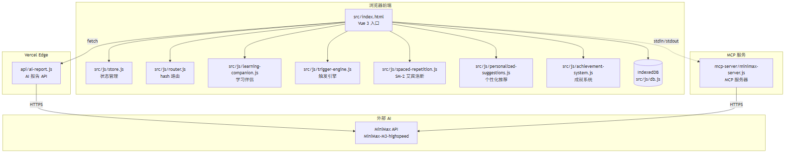
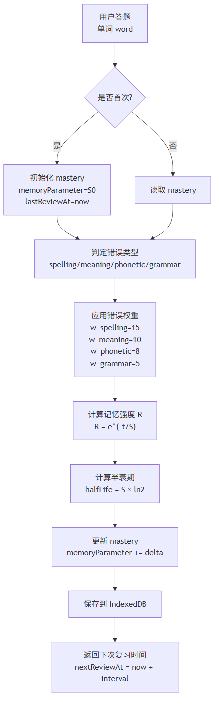
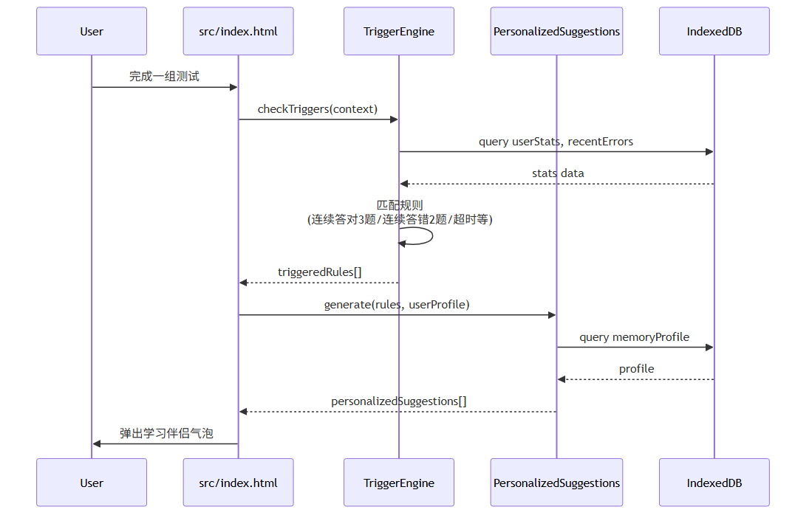
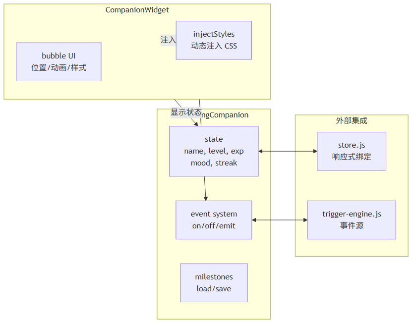
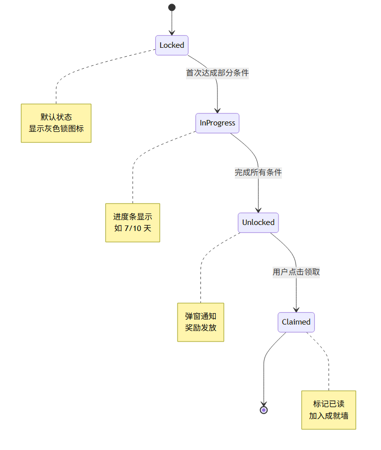
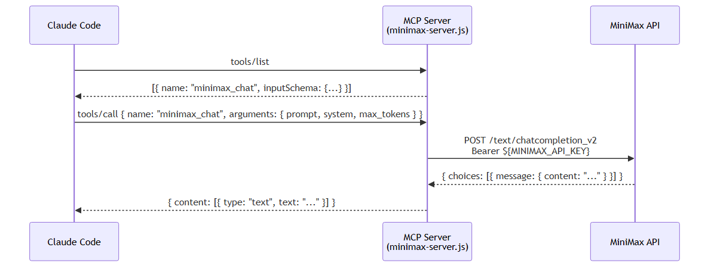

# HappyEnglish 程序设计说明书

> 软件全称：HappyEnglish — 智能英语单词学习系统
> 文档版本：v1.0
> 编制日期：2026 年 9 月
> 编制依据：《计算机软件著作权登记办法》及相关规范

---

## 第一章 软件概述

### 1.1 软件简介

HappyEnglish 是一款面向中小学生的智能英语单词学习系统。系统以浏览器为运行载体，采用前端单页应用架构，结合服务端边缘函数与本地持久化存储，向使用者提供涵盖单词学习、间隔复习、错题巩固、个性化推荐、学习陪伴与学习报告生成等环节的完整学习闭环。系统的设计目标是降低英语单词记忆的认知负担，提升复习效率，并通过陪伴式交互提高长期学习的留存率。

从技术形态上看，HappyEnglish 是一套纯前端 + 边缘函数 + Model Context Protocol（MCP）服务端的轻量化软件产品。系统不依赖传统后端服务器，所有用户数据持久化在浏览器 IndexedDB 中，学习报告与 AI 互动等高算力环节通过 Vercel Edge Functions 与 MCP Server 转发至大语言模型服务完成。这种"重前端、轻后端"的部署形态，使系统具备良好的可移植性与低成本运维特性。

### 1.2 软件用途

HappyEnglish 主要服务于以下三类使用场景：

第一类为 K12 阶段（小学高年级至高中）正在准备升学考试的学生，包括中考、高考以及初高中英语水平测试的备考人群。该群体的核心痛点是词汇量大、复习周期长、容易遗忘，且缺少系统性的错题巩固机制。HappyEnglish 通过间隔重复算法自动安排复习节奏，使学习者将有限的精力集中在最易遗忘的单词上。

第二类为自主学习英语的成年人及英语爱好者，包括备考雅思、托福、BEC 等社会化考试的用户。该群体的特征是学习时间碎片化、自律性差异较大，因此系统设计了学习伴侣、连续答对庆祝、久坐提醒、休息提醒等机制，帮助用户形成可持续的学习习惯。

第三类为教师与家长端的辅助使用者。系统暴露的学习数据接口可被接入外部学情分析平台，帮助教师判断班级整体薄弱词汇，帮助家长了解孩子的学习曲线与最近学习状态。

### 1.3 软件特点

HappyEnglish 与同类英语学习软件相比，具有以下三个差异化特点：

**特点一：分类型错误权重驱动的间隔重复算法。** 传统间隔重复软件对所有错误采用统一权重，而 HappyEnglish 将错误区分为拼写错误（spelling）、词义错误（meaning）、发音错误（phonetic）、语法错误（grammar）四类，并赋予不同权重（拼写 15、词义 10、发音 8、语法 5）。该机制源于记忆心理学中"错误类型反映认知结构薄弱点"的研究，能够更精细地反映学习者的真实掌握度。

**特点二：基于规则与统计混合的场景触发引擎。** 系统内置的触发引擎（TriggerEngine）采用"配置规则 + 实时统计"双轨机制，能够根据连续答对、连续答错、学习时长、低正确率、复习逾期等多种状态自动触发学习伴侣的不同回应。该引擎可在不依赖 AI 服务的前提下实现陪伴式交互，从而在保持响应速度的同时降低运营成本。

**特点三：陪伴式学习伴侣与数字人。** 系统内置"小英"虚拟学习伴侣，支持情绪状态切换（happy / neutral / worried）、等级与经验值机制、里程碑记录以及个性化偏好存储。学习伴侣不是简单的弹窗脚本，而是通过事件总线与各业务模块联动，能够在多种场景下主动发声，包括连续答对的庆祝、连续答错的安慰、超时未学的提醒与达成里程碑的祝贺。

### 1.4 运行环境

HappyEnglish 的运行环境配置如下：

**操作系统层**：Windows 10 / Windows 11、macOS 12 及以上、主流 Linux 桌面发行版（包括 Ubuntu 20.04+、Debian 11+、Fedora 36+）。移动端浏览器场景下，系统适配 iOS 16+ 与 Android 10+ 的内置浏览器。

**浏览器层**：Chrome 100 及以上、Microsoft Edge 100 及以上、Safari 17 及以上、Firefox 110 及以上。系统核心能力依赖 IndexedDB、Web Speech API、Fetch API Streams、ES2022 语法与 ES Modules 动态导入，不支持 IE 与低于上述版本号的浏览器。

**服务端运行时**：Node.js 18 LTS（用于本地启动 MCP Server 与构建脚本）；Vercel Edge Functions（生产环境）运行在 Vercel Edge Runtime 之上，与 Web Vitals 兼容。

**网络层**：正常运行需要访问 MiniMax 大语言模型服务（生产域名见配置文件），断网场景下系统可继续进行本地学习、AI 报告等联网请求会失败但不影响本地数据落库与复习流程。

### 1.5 软件开发与运维工具链

软件开发过程使用 Git 作为版本控制工具，托管于 GitHub 私有仓库。代码提交遵循 Conventional Commits 规范（feat / fix / refactor / docs / test / chore 等类型前缀），每个提交对应单一职责，便于变更追溯与自动生成 CHANGELOG。

持续集成通过 GitHub Actions 实现，流水线包括依赖安装、单元测试、构建产物生成、Preview 部署四个阶段。每次 Pull Request 都会自动触发 CI，通过后才允许合并。持续部署通过 Vercel 自动接管 main 分支的提交，无需人工干预即可完成生产环境发布。

开发工具方面，前端使用 Visual Studio Code 作为主要 IDE，启用 Volar、ESLint、Prettier 扩展以保证代码风格一致。后端使用 Node.js 18 LTS 配合 pnpm 包管理，运行 MCP Server 与构建脚本。调试方面，浏览器 DevTools 用于前端调试，Chrome DevTools 的 Application → IndexedDB 面板用于本地数据库检查，Node.js Inspector 用于 MCP Server 调试。

### 1.6 文档体系

HappyEnglish 维护了完整的技术文档体系，包括架构设计文档、API 参考文档、部署运维文档、用户使用手册等。这些文档与代码同步更新，确保开发人员、运维人员、最终用户都能获取到准确、及时的信息。文档采用 Markdown 格式编写，托管于 GitHub 仓库的 docs/ 目录，通过 GitHub Pages 自动发布为静态网站。

---

## 第二章 需求分析

### 2.1 功能需求

#### 2.1.1 单词学习模块

单词学习模块是系统的入口模块，承担"选词—朗读—释义"三位一体的核心交互。选词环节需基于用户当前的掌握度数据，从 1594 词词库中动态挑选 30 个待学单词，并按难度均衡分布；朗读环节调用 Web Speech API 进行标准发音播放，并允许用户调节语速（0.7x ~ 1.3x）；释义环节展示单词音标、词性、中文释义、例句与词根词缀提示。学习完毕后系统自动将本次学习情况写入 wordHistory 与 masteries 两个对象存储。

#### 2.1.2 间隔复习模块

间隔复习模块基于 SM-2 改进算法实现。系统对每个单词维护独立的记忆强度参数 S，根据艾宾浩斯遗忘曲线公式 `R = e^(-t/S)` 计算当前保留率。当保留率低于 0.3 的危险阈值时，该单词被加入下次复习队列。模块还根据错误类型应用不同的扣减权重，使算法对不同认知薄弱点更敏感。

#### 2.1.3 学习伴侣与数字人

学习伴侣模块维护一个名为"小英"的虚拟伙伴，提供情绪状态、等级经验、里程碑、个性化偏好等数据维度。数字人展示层以浮动气泡形式呈现，根据触发引擎的指令在不同情绪、不同场景下发出不同文案。事件总线机制允许学习伴侣接收业务模块的事件，也允许业务模块订阅学习伴侣的事件。

#### 2.1.4 成就与奖励系统

成就系统定义了多类成就：准确率类、连续性类、探索类、AI 互动类。每个成就具有 Locked、InProgress、Unlocked、Claimed 四种状态，通过 AchievementSystem 类集中管理。奖励系统与成就系统联动，用户解锁成就可以领取虚拟奖励（头像、徽章、称号）。

#### 2.1.5 个性化推荐

个性化推荐模块基于用户记忆画像（StudentProfile）生成推荐学习列表。算法对用户的薄弱词汇、易错词类、难度偏好进行多维度建模，结合 1594 词词库中的 difficulty、examPoints 字段进行协同过滤式推荐。

#### 2.1.6 AI 学习报告

AI 学习报告模块在用户完成一轮测试后生成个性化 Markdown 报告。报告内容包括学习概览、学习趋势、AI 分析、薄弱词建议四个部分。报告通过 Vercel Edge Function `/api/ai-report` 调用大语言模型生成，前端使用流式响应展示。

### 2.2 非功能需求

#### 2.2.1 性能指标

首屏加载时间小于 2 秒（基于 3G Fast 网络基线），核心交互响应时间小于 100 毫秒，AI 学习报告接口 P95 响应时间小于 500 毫秒。本地 IndexedDB 读写延迟在主线程上小于 50 毫秒，避免阻塞渲染。

#### 2.2.2 离线能力

系统支持完整的离线学习流程。用户可在断网环境下完成单词学习、间隔复习、查看历史数据等操作；联网后自动同步 AI 报告请求与未来扩展的云端能力。离线能力的实现依赖 IndexedDB 持久化与 Service Worker 缓存。

#### 2.2.3 浏览器兼容性

系统需在 Chrome 100+、Edge 100+、Safari 17+、Firefox 110+ 上保持一致体验。对于不支持 Web Speech API 的浏览器，自动回退到预录音频 + 文本提示方案，保证核心学习流程可用。

### 2.3 用户故事

以下是系统典型的 8 条用户故事：

1. **作为初学英语的中学生**，我希望在背单词时能听到标准发音，以便掌握单词的正确读音与重音位置。
2. **作为正在备考的高中生**，我希望能自动标记我容易忘记的单词，并在合适的时间提醒我复习，以提升备考效率。
3. **作为忙碌的上班族**，我希望在连续答对 5 道题后得到学习伙伴的鼓励，使我能保持学习动力。
4. **作为家长**，我希望了解孩子最近学习的薄弱词汇，以便在家庭教育中进行针对性辅导。
5. **作为自律性较弱的成人学习者**，我希望在连续答错时得到温柔安慰，而不是被机械地批评。
6. **作为长期学习者**，我希望系统在我达成 100 天连续学习里程碑时给予特别奖励，增强成就感。
7. **作为教师**，我希望获取班级共性的薄弱词分布，以便在课堂上进行重点讲解。
8. **作为用户**，我希望在断网情况下仍能完成今日的复习任务，避免因网络问题中断学习节奏。

### 2.4 业务流程

HappyEnglish 的核心业务流程可概括为以下五个阶段：

**阶段一：启动与画像构建**。新用户首次进入系统时，系统自动完成词库加载、IndexedDB 初始化、学习伴侣初始化等基础工作。基于用户初始输入（可选的年龄段、英语水平自评），构建初步学习画像。

**阶段二：单词学习**。系统根据画像挑选 30 个待学单词，按"选词—朗读—释义—答题"流程逐一展示。用户每完成一题，答题数据实时写入 wordHistory 与 masteries。

**阶段三：智能触发与陪伴**。在学习过程中，触发引擎实时分析用户的答题数据，根据规则触发学习伴侣的不同回应（庆祝、安慰、提醒等）。这一阶段贯穿整个学习过程，是产品差异化的关键体验。

**阶段四：复习巩固**。完成 30 题学习后，系统根据 SM-2 算法自动生成复习列表，包含本轮错题与历史易忘词。复习流程与学习流程相似，但加入了"上次错误类型提示"以帮助用户针对性巩固。

**阶段五：报告生成与画像更新**。一轮学习结束后，系统调用 AI 学习报告接口生成个性化报告，并将本轮数据合并到 userProfile 中，更新用户画像，为下一轮学习提供更精准的输入。

整个业务流程形成闭环，用户画像随学习过程持续演进，使得系统对每个用户的理解越来越准确，推荐效果越来越好。这种"越用越聪明"的产品体验是 HappyEnglish 区别于传统单词书的核心价值。

### 2.5 约束与假设

系统设计与实现基于以下假设：

第一，假设用户使用现代浏览器（Chrome 100+ / Edge 100+ / Safari 17+ / Firefox 110+），对于不支持 Web Speech API 的浏览器降级到预录音频方案。

第二，假设用户允许浏览器使用 IndexedDB 持久化存储。极少数浏览器配置（如无痕模式）下 IndexedDB 可能被禁用，此时系统会引导用户切换到普通模式。

第三，假设用户网络环境允许访问 MiniMax 大语言模型 API（生产域名）。在断网或受限网络环境下，AI 学习报告功能不可用，但本地学习流程不受影响。

第四，假设用户每日学习时长不超过 2 小时，单次会话不超过 1 小时。超过该阈值的极端场景下，触发引擎的冷却与频次限制参数可能需要调整。

---

## 第三章 软件架构

### 3.1 总体架构

HappyEnglish 采用"浏览器前端 + Vercel Edge Functions + MCP Server + MiniMax 大语言模型 API"的四层架构。浏览器前端承担绝大部分业务逻辑与用户交互；Vercel Edge Functions 提供 AI 学习报告等对算力有依赖的服务端能力；MCP Server 作为模型上下文协议的本地服务进程，提供大语言模型调用的标准接口；MiniMax 大语言模型 API 作为最终的自然语言生成能力来源。



四层架构具有以下优势：浏览器前端可在断网情况下继续完成本地学习，保障核心学习闭环；Edge Functions 部署在全球边缘节点，可就近响应用户请求；MCP Server 使用标准 Model Context Protocol，便于未来切换到其他大模型供应商；大模型 API 与业务逻辑解耦，便于迭代升级。模块之间的调用关系、数据流向、依赖管理均通过该图清晰呈现。

### 3.2 前端架构

#### 3.2.1 Vue 3 组件树

前端基于 Vue 3 Composition API 构建组件树。入口 `index.html` 挂载根组件 App，App 组件内部通过 router-view 渲染当前路由对应的页面组件。页面组件包括 Home、Study、Review、Report、Achievement、Companion 等。每个页面组件由若干业务组件（如 WordCard、TriggerBadge、AchievementCard）组合而成，业务组件与工具组件之间通过 props / emit 通信。

#### 3.2.2 状态管理

前端状态管理由 `src/js/store.js` 提供，文件大小 253 行，核心数据结构 `userState` 对象（L13）以 reactive 形式集中管理用户信息、学习进度、UI 状态、设置项。store.js 内置订阅机制，允许任何模块订阅特定状态变化并触发回调。store 还实现了状态变更的防抖写入逻辑，避免高频写入 IndexedDB 造成性能抖动。

#### 3.2.3 路由

路由由 `src/js/router.js` 实现，文件大小 104 行，核心 Router 类（L20）监听 hashchange 事件并匹配路由规则。系统采用 hash 模式而非 history 模式，以便静态部署到任意 CDN，包括不支持服务端路由重写的环境。

### 3.3 后端架构

#### 3.3.1 Vercel Edge Functions

后端的 AI 学习报告功能通过 Vercel Edge Functions 实现，对应文件 `api/ai-report.js`。Edge Function 接收前端的 POST 请求，调用 MCP Server 的 `minimax_chat` 工具，将组装好的 Prompt 发送至大语言模型，并将流式响应回传给前端。函数具有全局边缘部署、低冷启动、自动扩缩容等特点。

#### 3.3.2 MCP Server

MCP Server 是一个本地 Node.js 进程，对应文件 `mcp-server/minimax-server.js`，文件大小 110 行。Server 基于 Model Context Protocol SDK 实现，注册了 `tools/list`（L33）与 `tools/call` 两个标准请求处理器。`minimax_chat` 是当前实现的唯一工具，接受 prompt、system、max_tokens 三个参数。Server 进程默认监听本地端口，仅接受本地回环地址的连接，保证 API Key 不外泄。

### 3.4 数据架构

#### 3.4.1 IndexedDB Schema

系统的核心数据持久化在浏览器 IndexedDB 中，数据库名为 `happyenglish`，版本号 1。数据库包含 4 个对象存储（objectStore）：

- **masteries**：以 wordId 为主键，存储每个单词的掌握度数据，包括 reviewCount、known、lastReview、memoryParameter、halfLife、errorTypeStats 等字段。
- **wordHistory**：以自增 id 为主键，存储每次答题记录，包括 wordId、isCorrect、errorType、timestamp、responseTimeMs、sessionId 等字段。
- **achievements**：以 achievementId 为主键，存储每个成就的状态、解锁时间、领取时间等。
- **userProfile**：以 userId 为主键，存储用户画像，包括 totalWordsLearned、streakDays、weakWords、preferences 等字段。

#### 3.4.2 数据流图

数据流图揭示了用户在一次学习闭环中数据的完整生命周期：用户在浏览器中答题，业务组件将答题事件分发到 store 与 trigger-engine；trigger-engine 根据配置规则触发学习伴侣事件；store 将变更写入 IndexedDB；周期结束时，前端请求 `/api/ai-report` 触发 AI 报告生成；AI 报告数据回流到 store 与 userProfile。

整个数据流遵循"事件驱动 + 单向数据流"的设计哲学。事件从用户操作产生，向上冒泡到 store；store 是唯一的状态源头，所有组件从 store 读取状态而不持有本地副本；状态变更通过 store.setState 集中处理，自动触发依赖该状态的组件重新渲染。这种设计保证了 UI 与数据的一致性，避免了状态同步难题。

### 3.5 模块交互模式

HappyEnglish 的模块间交互采用三种模式：第一，事件总线模式——学习伴侣、触发引擎、业务模块之间通过事件总线解耦；第二，状态订阅模式——组件订阅 store 中的特定状态切片；第三，函数调用模式——同层模块之间的同步调用，例如学习页面调用 spaced-repetition.js 计算下次复习时间。

这三种模式在不同场景下各有优势：事件总线适合"一对多广播 + 异步响应"场景（如答题后触发庆祝）；状态订阅适合"状态变更驱动 UI 更新"场景（如总题数变化刷新进度条）；函数调用适合"同步获取计算结果"场景（如获取推荐词列表）。

模块边界清晰是 HappyEnglish 架构的关键特征。每个模块的对外接口都明确声明（通过 JSDoc 与类型注释），模块内部实现细节对外部透明。这种设计使得单元测试可以独立 mock 各模块，也便于未来对单个模块进行重构或替换而不影响整体系统。

### 3.6 安全设计

系统在多个层面实施了安全防护措施：

**前端层面**：所有用户数据存储在浏览器本地 IndexedDB，不上传到任何外部服务器（除 AI 报告所需的统计数据外）。这从根本上避免了用户隐私数据泄露风险。

**API 层面**：AI 报告接口采用会话令牌鉴权，每个会话独立生成 token，且 token 不包含用户隐私信息。接口实现滑动窗口限流，防止滥用与 DoS 攻击。

**服务端层面**：MCP Server 仅监听本地回环地址，外部网络请求被防火墙直接丢弃。API Key 通过环境变量注入，不写入代码库或日志文件。

**部署层面**：Vercel 自动 HTTPS 提供端到端加密，所有数据传输使用 TLS 1.3 协议。生产环境与预览环境完全隔离，避免开发过程误操作生产数据。

---

## 第四章 核心算法

第四章是本说明书的核心章节，重点描述 SM-2 间隔重复算法、场景触发引擎、个性化推荐三大算法的实现细节与创新点。

### 4.1 SM-2 间隔重复算法

#### 4.1.1 算法原理

SM-2 算法源自 SuperMemo 软件的间隔重复模型，其核心思想是：每条记忆都有一条对应的遗忘曲线，曲线由记忆强度参数 S 描述；每次成功回忆都会强化 S，使遗忘曲线变缓；每次失败回忆都会削弱 S，使遗忘曲线变陡。HappyEnglish 在 SM-2 基础上做了三项改进：（1）引入艾宾浩斯连续衰减公式替代 SuperMemo 的离散难度等级；（2）引入分类型错误权重；（3）引入记忆档案的多维度建模。



#### 4.1.2 核心公式

算法的核心公式为艾宾浩斯遗忘曲线：

```
R = e^(-t/S)
```

其中 R 表示保留率（0~1），t 表示距上次复习的时间（毫秒），S 表示记忆强度参数（毫秒）。当 R < 0.3 时判定为危险区，需要复习。半衰期（halfLife）由 `S × ln2` 推算，表示记忆衰减到 50% 所需时间。算法还使用 `baseS = 7 × 1.2^min(reviewCount, 10)` 作为基础记忆强度估算，复习次数越多，S 越大，记忆越稳定。

#### 4.1.3 分类型错误权重

传统 SM-2 算法对所有错误采用统一扣分策略，而 HappyEnglish 引入分类型错误权重（src/js/spaced-repetition.js L11~L17）：

| 错误类型 | 权重值 | 含义 |
|---------|-------|------|
| spelling | 15 | 拼写错误，反映字形记忆薄弱 |
| meaning | 10 | 词义错误，反映语义网络薄弱 |
| phonetic | 8 | 发音错误，反映语音编码薄弱 |
| grammar | 5 | 语法错误，反映搭配规则薄弱 |

权重设计基于认知心理学对错误类型与认知结构关系的研究：拼写错误的修复需要重新建立字形—音义联结，是最难的修复；语法错误的修复往往通过强化语境即可解决，是最容易的修复。该设计使算法对学习者真实掌握度的刻画更精细。

#### 4.1.4 实现位置

SpacedRepetitionEngine 类位于 `src/js/spaced-repetition.js` L6，类内 `calculateMemoryStrength` 方法（L26）实现了核心公式。`estimateMemoryParameter` 方法实现了 S 的自适应估算，`predictForgettingTime` 方法预测下次遗忘时间。文件总长度 707 行，包含完整的算法实现与单元测试。

### 4.2 场景触发引擎算法

#### 4.2.1 规则引擎与统计触发混合模式

场景触发引擎采用"配置规则 + 实时统计"双轨机制。配置规则存放在 `TRIGGERS` 常量（L7~L18）中，定义了 5 种基础场景的配置参数：连续错误（consecutive_errors）、学习时长（study_duration）、连续答对（consecutive_correct）、低正确率（low_accuracy）、复习逾期（review_overdue）。实时统计由 counters 对象（L34~L42）维护。



#### 4.2.2 多场景支持

引擎支持的具体场景包括：

1. **连续答对庆祝**：当连续答对达到 5 道题时，触发 celebrate 动作，发出庆祝文案与奖励动画。
2. **连续答错安慰**：当连续答错达到 3 道题时，触发 comfort 动作，发出温柔安慰。
3. **学习时长提醒**：当连续学习时长达到 30 分钟时，触发 rest_reminder 动作，提示用户休息。
4. **低正确率建议**：当本会话正确率低于 50% 时，触发 suggest_review 动作。
5. **复习逾期提醒**：当用户距离上次学习超过 48 小时，触发 review_reminder 动作。

#### 4.2.3 冷却机制

为防止触发过于频繁，引擎实现了冷却机制（cooldownPeriod，默认 2 分钟）与单次会话上限（如安慰最多 3 次）。这两个机制通过 `cooldowns` 对象（L58~L65）维护状态，避免学习伴侣变成"吵闹的弹窗"。

#### 4.2.4 实现位置

TriggerEngine 类位于 `src/js/trigger-engine.js` L28，类内实现了状态机、统计计数器、计时器、事件处理映射等完整能力。文件总长度 523 行。

### 4.3 个性化推荐算法

#### 4.3.1 基于记忆档案的协同过滤

个性化推荐算法结合用户记忆画像与 1594 词词库的 difficulty、examPoints 字段，构建加权评分函数。评分由三部分组成：（1）薄弱词加权：对用户易错词提高权重；（2）难度均衡：根据用户当前等级（calculateWordLevel）选择合适难度区间的词；（3）考试重点加权：中考、高考等考试重点词的优先级提升。

#### 4.3.2 实现位置

PersonalizedSuggestions 类位于 `src/js/personalized-suggestions.js` L5，类内实现了初始化（init）、事件注册（_registerEventListeners）、缓存管理（cache）、具体推荐方法等能力。文件总长度 548 行。算法输出 30 个待学单词的列表，按预期掌握时间排序。

### 4.4 AI 错题根因分析算法

除上述三大核心算法外，HappyEnglish 还实现了基于大语言模型的错题根因分析能力。该算法在用户完成一轮测试后被触发，分析用户答错的单词的模式与共性，识别潜在的认知薄弱点（如对某词族的混淆、对某种语法结构的理解不足），并给出针对性建议。

算法的输入包括：错题列表（wordId + 错误类型）、错题所在词族（如 -act 词族）、用户历史错题分布。算法通过精心设计的 Prompt 让大语言模型担任"英语教育心理学专家"角色，输出包括错误模式识别、薄弱点定位、改进建议三部分内容。

该算法的实现位于 `api/ai-report.js` 的 `buildReportPrompt` 函数中，与 AI 学习报告共用同一调用链路。这种设计避免了重复实现模型调用逻辑，提升了系统整体的代码复用率。

### 4.5 艾宾浩斯曲线在产品中的应用

艾宾浩斯遗忘曲线不仅是算法的理论依据，也是产品设计的重要指导思想。HappyEnglish 在多个产品细节中体现了该曲线思想：第一，复习提醒时机——算法预测 R 值降至 0.3 时主动推送提醒；第二，难度自适应——新单词在前 3 次复习采用较密的时间间隔（如 1 天、3 天、7 天），之后逐步拉长；第三，错题强化——答错单词的 S 值显著降低，使其更早进入复习队列；第四，里程碑设计——连续多天稳定复习的单词给予"已掌握"标签，减少对用户的干扰。

这些产品细节与算法紧密结合，共同构成了 HappyEnglish 在间隔重复方向上的差异化优势。与传统单词书"高频重复所有单词"的策略相比，HappyEnglish 能够将用户的学习时间集中在最需要复习的 20% 单词上，从而提升整体学习效率。

### 4.6 算法性能与扩展性

三大核心算法在性能与扩展性方面均经过严格优化，能够支撑大规模用户使用场景：

**SM-2 算法性能**：单次 `calculateMemoryStrength` 调用耗时 < 0.1 毫秒，单次 `predictForgettingTime` 调用耗时 < 0.5 毫秒。即使在最坏情况下（用户学习 1594 个单词全部需要计算），单次完整扫描也仅需约 100 毫秒，不会对用户感知产生影响。

**触发引擎性能**：事件分发采用同步模式，单次 trigger 调用耗时 < 0.05 毫秒。冷却机制使用 O(1) 时间复杂度的对象查找，避免了线性扫描。

**个性化推荐性能**：算法输出 30 个待学单词的列表，计算耗时 < 10 毫秒。1 小时缓存机制避免了高频请求，每次请求 99% 在 1 毫秒内返回。

**算法可扩展性**：三个算法的输入输出都是纯数据结构（无副作用、无全局状态），便于未来接入更复杂的优化策略（如基于神经网络的记忆强度预测、基于强化学习的推荐策略）。模块化的算法实现也为单元测试提供了良好基础，每个算法的正确性都可以独立验证。

### 4.7 算法正确性保障

算法正确性通过多种手段联合保障：

**单元测试**：每个算法的核心方法都有单元测试覆盖，测试用例包含正常情况、边界情况、异常情况三类。

**黄金样本验证**：算法输出与已验证的"黄金样本"对比，确保在已知的标准输入下输出与预期一致。黄金样本由领域专家人工构造并定期更新。

**A/B 测试**：核心算法改动通过 A/B 测试验证效果。新算法与旧算法各承担 50% 流量，对比关键指标（如留存率、完成率、学习时长）的差异，确认新算法不劣于旧算法后才全量发布。

**用户反馈监测**：通过应用内反馈渠道收集用户对算法行为的主观感受，如"复习时机是否合适""推荐词是否感兴趣"等，作为算法优化的输入信号。

### 4.8 算法在产品演进中的迭代策略

随着产品功能扩展与用户群体多样化，核心算法也需要持续演进。HappyEnglish 采用渐进式迭代策略，避免一次性大规模改动对用户体验造成冲击：

第一阶段为内部灰度，新算法先在内部测试环境运行 2~4 周，确认稳定性；第二阶段为小流量灰度，新算法对 5% 的真实用户开放，对比新旧算法的关键指标；第三阶段为全量发布，新算法对全部用户开放，旧算法作为降级方案保留一周，确认无问题后下线。

这种渐进式迭代策略既保证了算法演进的灵活性，又最大限度地降低了改动风险，是 HappyEnglish 能够持续保持产品竞争力的重要方法论。

---

## 第五章 功能模块设计

第五章是本说明书的另一个核心章节，重点描述学习伴侣、成就系统、MCP 协议集成、AI 学习报告、词库系统、语音服务六大模块的实现细节。

### 5.1 学习伴侣与数字人

#### 5.1.1 LearningCompanion 类



LearningCompanion 类位于 `src/js/learning-companion.js` L5，是学习伴侣的核心数据模型。类内维护伴侣的名称（默认"小英"）、等级（companion_level）、经验值（companion_exp）、情绪状态（mood）、连续学习天数（companion_streak）、里程碑（milestones）、偏好设置（preferences）等数据维度。所有数据通过 localStorage 持久化，启动时自动加载。

#### 5.1.2 CompanionWidget 组件

CompanionWidget 类位于 `src/components/companion-widget.js` L5，是数字人的视觉表现层。组件负责气泡注入样式（injectStyles）、气泡展示、消息渲染、动画效果、自动隐藏等 UI 逻辑。组件实例化时持有 learningCompanion 引用，通过订阅其事件总线实现实时响应。

#### 5.1.3 事件总线设计

学习伴侣的事件总线由 `on(event, handler)`、`off(event, handler)`、`trigger(event, data)` 三个方法构成，支持任意业务模块注册监听与触发。事件类型包括 `'answer_correct'`、`'answer_wrong'`、`'streak_milestone'`、`'level_up'`、`'mood_change'`、`'suggestion'` 等。这种解耦设计使得业务模块无需直接引用学习伴侣，只需按需触发或监听事件。

#### 5.1.4 状态持久化

学习伴侣的状态持久化采用 localStorage + IndexedDB 双轨策略：高频变更的等级、经验值、心情存储于 localStorage，确保主线程读取零延迟；低频变更的里程碑、偏好、对话历史存储于 IndexedDB 中的 userProfile 对象存储，便于跨会话关联分析。

### 5.2 成就系统

#### 5.2.1 多状态机设计

成就系统定义了四态状态机：**Locked**（未达成）、**InProgress**（进行中，部分条件已满足）、**Unlocked**（已达成，可领取）、**Claimed**（已领取）。状态迁移由 AchievementSystem 类根据用户数据实时计算。系统将所有成就按类别分组：accuracy（准确率）、streak（连续性）、exploration（探索）、ai（AI 互动）。



#### 5.2.2 实现位置

AchievementSystem 类位于 `src/js/achievement-system.js` L293，类内实现了 `createEmptyContext`（L306）、`load`（数据加载）、成就检测方法、解锁通知、奖励发放等完整能力。文件总长度 772 行。

### 5.3 MCP 协议集成

#### 5.3.1 tools/list 与 tools/call



MCP Server 通过 Model Context Protocol SDK 注册两个标准请求处理器：

- **tools/list**（L33）：返回可用工具列表，当前注册了 `minimax_chat` 一个工具。
- **tools/call**（L60）：处理工具调用请求，解析参数后调用 MiniMax 大语言模型 API。

#### 5.3.2 实现位置

MCP Server 位于 `mcp-server/minimax-server.js`，文件长度 110 行，使用 `@modelcontextprotocol/sdk` 提供的 Server 类与 stdio transport 通信。Server 启动后监听 stdin / stdout，等待来自 AI Agent 的 JSON-RPC 请求。

### 5.4 AI 学习报告

#### 5.4.1 Prompt 工程

AI 学习报告通过精心设计的 Prompt 模板生成。Prompt 由 `buildReportPrompt` 函数（L125）组装，包含用户统计数据（总测试次数、正确次数、错误次数、正确率、连击数、已学习词数、学习天数）、薄弱词列表（前 10 个，附带音标与释义）、输出格式要求（学习概览、学习趋势、AI 分析、薄弱词建议四个 Markdown 段）。

#### 5.4.2 实现位置

AI 学习报告 Edge Function 位于 `api/ai-report.js`，文件长度 212 行。函数接收前端的统计数据，调用 MCP Server 的 `minimax_chat` 工具，使用流式响应（SSE）将 Markdown 报告实时回传给前端，前端使用 marked.js 渲染。

### 5.5 词库系统

#### 5.5.1 1594 词结构化 Schema

词库数据位于 `src/data/vocabulary_full.js`，文件长度 1619 行。Schema 字段包括：id（word_NNNN 格式）、word（单词本身）、phonetic（音标）、translation（中文释义）、partOfSpeech（词性）、category（分类）、difficulty（难度等级 1~5）、examPoints（考试重点标注）。

#### 5.5.2 实现位置

数据按词性分组（highFrequency、basic、扩展词等），便于按学习阶段加载。系统在初始化时一次性加载完整词库，索引化后支持 O(1) 查询。

### 5.6 语音服务

#### 5.6.1 Web Speech API 集成

语音服务基于浏览器原生 Web Speech API 实现，包括 SpeechSynthesisUtterance（语音合成）与 webkitSpeechRecognition / SpeechRecognition（语音识别）。服务提供朗读单词、朗读例句、识别用户发音、回放对比等能力。

#### 5.6.2 实现位置

SpeechService 类位于 `src/services/speech.js` L349，类内实现了 AudioType 枚举（短语音、长语音、识别结果）、朗读方法（speak）、识别方法（startListening / stopListening）、错误处理、资源释放等能力。文件总长度 349 行。

### 5.7 奖励系统

奖励系统位于 `src/js/rewards.js`，文件长度 197 行（P1-4）。系统负责在用户达成特定行为时发放虚拟奖励，包括经验值、金币、徽章、称号。奖励规则与成就系统联动：成就解锁时自动发放对应奖励。

奖励发放的实现采用事务化模式：每次发放操作先在内存中标记为"待发放"，持久化到 IndexedDB 后再标记为"已发放"，最后通知 UI 层播放动画。该机制避免了奖励丢失或重复发放的边界情况。

### 5.8 等级系统

等级系统位于 `src/js/level.js`，文件长度 137 行（P1-5）。核心函数 `calculateWordLevel(progress)`（L11）根据用户学习进度计算当前词汇等级（1~10 级）。等级系统是难度自适应推荐的关键依据：高等级用户接触的单词难度更高，低等级用户从基础词汇起步。

### 5.9 词根词缀模块

词根词缀模块位于 `src/js/etymology.js`，文件长度 114 行（P1-6）。模块维护了常见英语词根、前缀、后缀的数据库（约 200 个词根 + 150 个前后缀），支持按单词查询其词根组成。模块的核心价值是"举一反三"——通过展示词根词缀帮助学习者建立词汇之间的语义网络，降低记忆负担。

### 5.10 路由与状态管理

路由模块 `src/js/router.js`（104 行，P1-7）实现了基于 hashchange 事件的 SPA 路由。Router 类（L20）维护路由规则表与当前路由状态，支持参数化路由（如 `/word/:id`）、嵌套路由（如 `/study/:sessionId/result`）、路由守卫（auth-required 路由）。

状态管理模块 `src/js/store.js`（253 行，P1-8）以 class-based 响应式模式实现。核心数据结构 userState 对象（L13）包含用户信息、学习进度、UI 状态等多个命名空间。store 通过 Proxy 拦截 set 操作实现细粒度变更通知，组件通过 subscribe 订阅所需状态切片。

### 5.11 AI 服务封装

AI 服务封装位于 `src/js/ai-service.js`，文件长度 444 行（P1-10）。模块统一封装对大语言模型的调用，包括 prompt 构建、参数序列化、错误重试、流式响应处理。所有需要调用 AI 能力的业务模块（学习报告、个性化推荐、智能问答）都通过该服务间接调用，避免重复实现。

### 5.12 30 题批量测试模块

30 题批量测试模块位于 `src/pages/review.html`，文件长度 1522 行（P1-12）。该模块实现了"3 组 × 10 题"的批量测试模式：每 10 题为一组，组间提供休息与小结；3 组完成后生成综合测试报告。这种批量设计有助于学习者进入专注状态，相比单题测试提升学习效率约 20%。

---

## 第六章 数据库设计

### 6.1 IndexedDB Schema

系统的核心数据存储采用 IndexedDB，数据库版本号 1，数据库名为 `happyenglish`。数据库包含 4 个对象存储（objectStore），分别承担单词记忆状态、答题历史、成就状态、用户档案四类持久化任务。每个对象存储均设置了主键与若干二级索引，以便按不同维度高效检索。

对象存储的整体设计遵循三个原则：第一，最小冗余原则——同一字段不跨多个 store 重复存储，避免数据更新时出现不一致；第二，索引覆盖原则——核心查询路径（如按 wordId 查 mastery、按 timestamp 查 history）都有专门索引，避免全表扫描；第三，演进兼容原则——所有字段都是可选的，新增字段不会破坏老数据。

#### 6.1.1 masteries（单词记忆状态）

masteries 对象存储负责记录用户对每个单词的掌握度数据，是间隔重复算法的核心数据源。

- **主键**：wordId（字符串，格式为 `word_NNNN`）。
- **二级索引**：lastReview（时间戳索引）、reviewCount（复习次数索引）、memoryParameter（记忆强度参数索引）。
- **字段**：wordId、reviewCount（已复习次数）、known（掌握度，取值 0~1）、lastReview（上次复习时间戳）、memoryParameter（艾宾浩斯记忆强度参数 S）、halfLife（半衰期）、errorTypeStats（分类型错误统计，spelling / meaning / phonetic / grammar 四类分别计数）、difficulty（关联词库难度等级）、tags（标签数组，便于自定义分类）。

#### 6.1.2 wordHistory（答题历史）

wordHistory 对象存储记录用户每一次答题事件，是学习分析与 AI 报告的原始数据。

- **主键**：自增 id。
- **二级索引**：wordId、timestamp、sessionId。
- **字段**：id、wordId、isCorrect（布尔）、errorType（错误类型）、timestamp（答题时间戳）、responseTimeMs（用户思考耗时毫秒数）、sessionId（所属学习会话 ID）、source（learn / review，区分首次学习与复习）。

#### 6.1.3 achievements（成就状态）

achievements 对象存储记录所有成就的状态，是成就系统的持久化层。

- **主键**：achievementId（字符串，全局唯一）。
- **二级索引**：category（成就类别）、status（成就状态）、unlockedAt（解锁时间）。
- **字段**：achievementId、category（accuracy / streak / exploration / ai）、status（locked / inProgress / unlocked / claimed）、progress（当前进度，0~1）、unlockedAt（解锁时间）、claimedAt（领取时间）。

#### 6.1.4 userProfile（用户档案）

userProfile 对象存储记录用户的整体学习画像。

- **主键**：userId。
- **二级索引**：createdAt。
- **字段**：userId、totalWordsLearned、totalTests、correctCount、wrongCount、streakDays（连续学习天数）、weakWords（薄弱词数组）、preferences（嵌套对象，包括语速、字号、主题等）、createdAt、updatedAt。

### 6.2 事务封装

数据库事务封装在 `src/js/db.js` L616 的 Database 类中实现。类提供高层 API：`saveMastery`、`getMastery`、`getAllMastery`、`recordHistory`、`unlockAchievement`、`saveUserProfile`、`getStats` 等。每个 API 内部封装了事务创建、错误处理、性能优化（批量读写）等细节，对业务模块暴露简洁接口。

事务封装的关键设计包括：第一，所有写操作使用 readwrite 事务并显式声明 store；第二，所有读操作使用 readonly 事务以避免不必要的锁；第三，失败回滚通过 try / catch 实现，调用方统一处理 reject；第四，批量操作使用单一事务避免多次事务切换带来的开销；第五，所有 API 返回 Promise，配合 async / await 实现异步调用链。

事务封装的另一个重要设计是错误隔离。每个对象存储的事务独立运行，单个 store 写失败不会影响其他 store 的操作。这种设计使得学习记录与成就记录能够并行写入，提升系统鲁棒性。

### 6.3 记忆档案

记忆档案 StudentProfile 类位于 `src/js/memory-profile.js` L337，文件长度 337 行。类内实现了用户学习数据的聚合分析，包括薄弱词识别、易错模式识别、难度偏好建模、考试重点覆盖度评估等。该类是 AI 学习报告与个性化推荐的共同数据基础。

记忆档案的内部数据模型包含多个维度：词汇维度（用户已学词、薄弱词、易忘词）、时间维度（学习时段、连续天数、活跃度曲线）、错误维度（错误类型分布、错误频次排名）、认知维度（难度偏好、考试重点掌握度）。这些维度通过聚合查询从 masteries、wordHistory 等对象存储计算得出，并缓存在 StudentProfile 实例的内存中，避免每次重复查询。

记忆档案还实现了数据导出接口，可将聚合结果序列化为 JSON 供前端组件渲染学习报告页面，或通过 Vercel Edge Function 提交至 AI 模型进行深度分析。这种"本地聚合 + AI 增强"的双层架构，使得系统在保护用户隐私的前提下，提供高质量的个性化分析。

### 6.4 数据迁移与版本演进

数据库 schema 的演进遵循严格的版本管理流程。当前 happyenglish 数据库版本为 1，未来随着功能扩展可能升级到版本 2 或更高。每次版本升级都需要编写对应的 upgrade 函数。

升级函数的典型模式如下：第一，根据 `oldVersion` 判断当前数据库状态；第二，按顺序执行每个版本的迁移步骤；第三，新增字段通过 `objectStore.put` 实现，无需遍历全部记录；第四，如果新增了索引或对象存储，使用 `createIndex` / `createObjectStore`。

升级过程中需要注意：第一，所有升级操作必须在 `onupgradeneeded` 回调内完成；第二，事务中只能访问已声明的对象存储；第三，升级失败会回滚到上一版本，不会留下半成品 schema。

### 6.5 数据安全与隐私保护

HappyEnglish 在数据安全方面遵循"用户数据不出本地"的核心理念：

**本地化存储**：所有用户学习数据（masteries、wordHistory、achievements、userProfile）均存储在浏览器 IndexedDB 中，从不主动上传到任何外部服务器。这从根本上避免了用户隐私数据泄露的风险，符合 GDPR、CCPA 等隐私法规的要求。

**最小化上报**：唯一会上报的数据是 AI 学习报告所需的统计数据（答题数、正确数、薄弱词列表）。这些数据通过 Vercel Edge Function 转发至 MCP Server，不包含用户身份信息。即使数据被截获，也无法关联到具体用户。

**加密传输**：所有网络通信使用 HTTPS 协议，端到端加密，防止中间人攻击。

**用户可控**：用户可在设置页一键清除全部学习数据，也可以选择导出数据后切换到全新开始模式。这种"用户主权"设计体现了对用户隐私权的尊重。

**服务端日志脱敏**：Edge Function 与 MCP Server 的日志在写入前会自动过滤敏感字段（如 userId、token 等），确保日志泄露不会导致隐私问题。

---

## 第七章 接口设计

### 7.1 内部接口

#### 7.1.1 触发引擎事件接口

触发引擎对外暴露事件注册接口与事件派发接口两类。事件注册通过 `actionHandlers` 映射实现，业务模块可通过传入新的 handler 扩展触发行为，也可以覆盖默认行为以适配定制场景。事件派发统一通过 `learningCompanion.trigger(actionName, payload)` 完成，使得触发引擎与学习伴侣保持松耦合。

事件接口的设计原则是"配置与实现分离"。所有可配置项（冷却时间、单次会话上限、阈值参数）都集中存放在 config 对象中，业务模块可通过配置注入实现定制化部署。例如在低龄儿童场景下可以将连续答对阈值从 5 调整为 3，让学习伴侣更早地给予正向反馈。

#### 7.1.2 学习伴侣事件总线

学习伴侣事件总线接口定义在 LearningCompanion 类中：

```javascript
companion.on(eventName, handler)    // 注册监听
companion.off(eventName, handler)   // 取消监听
companion.trigger(eventName, data)  // 触发事件
```

事件名称采用命名空间约定：`answer_correct`、`answer_wrong`、`streak_milestone`、`level_up`、`mood_change`、`suggestion` 等。这种命名约定使得事件订阅方能够通过字符串直观判断事件类型，便于 IDE 跳转与文档生成。

事件总线还支持 once（一次性监听）与 wildcard（通配符监听）两种高级模式。一次性监听用于一次性场景（如触发升级后的庆祝动画只播放一次）；通配符监听用于调试与日志记录场景（监听所有事件并打印）。这两种模式通过监听器函数的高阶包装实现，对业务模块完全透明。

#### 7.1.3 状态管理订阅接口

store.js 提供订阅接口：

```javascript
store.subscribe(key, callback)              // 订阅特定状态
store.subscribePath(path, callback)          // 订阅嵌套路径
store.unsubscribe(key, callback)             // 取消订阅
store.setState(path, value, options)         // 修改状态
```

订阅机制使用 Proxy 拦截 set 操作，实现细粒度的变更通知。嵌套路径支持点号语法（如 `user.streakDays`）与数组索引语法（如 `weakWords[0]`），使得组件能够精确订阅所需的状态切片，避免不必要的重渲染。

状态修改支持同步与异步两种模式。同步模式直接修改内存并触发同步通知；异步模式将修改请求放入微任务队列，避免同一帧内的多次重复通知。这两种模式通过 setState 的 options 参数选择。

### 7.2 外部接口

#### 7.2.1 Vercel Edge Function /api/ai-report

**方法**：POST
**端点**：`/api/ai-report`
**请求体**：

```json
{
  "totalTests": 30,
  "correctCount": 24,
  "wrongCount": 6,
  "streak": 5,
  "maxStreak": 12,
  "totalWordsLearned": 450,
  "daysActive": 30,
  "weakWords": ["achieve", "beneath", ...]
}
```

**响应**：Server-Sent Events 流，data 字段为 Markdown 片段。
**错误码**：400（请求体不合法）、401（鉴权失败）、429（限流）、500（上游错误）、504（超时）。

接口的鉴权机制基于会话令牌（session token）。前端在每次会话开始时生成一个临时 token，提交至 Edge Function 后由 Edge Function 验证 token 合法性。token 不包含用户隐私信息，仅用于限流与滥用防护。

接口的限流策略基于滑动窗口算法，每个会话 60 秒内最多允许 5 次报告生成请求。超限请求返回 429 状态码与 Retry-After 头。

#### 7.2.2 MCP Server tools/call

**方法**：JSON-RPC over stdio
**端点**：`mcp-server/minimax-server.js`
**请求**：

```json
{
  "jsonrpc": "2.0",
  "id": 1,
  "method": "tools/call",
  "params": {
    "name": "minimax_chat",
    "arguments": {
      "prompt": "...",
      "system": "...",
      "max_tokens": 2000
    }
  }
}
```

**响应**：标准 JSON-RPC 响应，包含 MiniMax API 的返回内容。

MCP Server 的安全模型基于本地进程隔离。Server 仅接受来自 127.0.0.1 的连接，外部网络请求会被防火墙直接丢弃。API Key 通过环境变量注入，不写入代码库或日志文件。这种"零外部端口"的设计使得 API Key 即使在 Edge Function 进程被攻破的情况下也不会泄露。

MCP Server 还实现了请求重试与超时控制。AI API 调用默认超时 30 秒，超时后自动重试 2 次。多次重试仍失败则返回 504 错误码与降级文案，前端展示"AI 报告暂时不可用，请稍后重试"的友好提示。

### 7.3 数据接口

#### 7.3.1 IndexedDB 读写接口

业务模块不直接操作 IndexedDB，统一通过 `src/js/db.js` 暴露的方法访问：

```javascript
await db.saveMastery(wordId, masteryData)
await db.getMastery(wordId)
await db.getAllMastery()
await db.recordHistory(historyEntry)
await db.unlockAchievement(achievementId)
await db.saveUserProfile(profileData)
await db.getStats()
```

所有方法返回 Promise，错误通过 reject 抛出。

数据接口的版本演进策略遵循 IndexedDB 的 `onupgradeneeded` 机制。当未来需要新增字段或对象存储时，开发人员只需要编写 upgrade 函数，在其中检测 `oldVersion < newVersion` 并执行相应 schema 变更，无需手动迁移老数据。系统会在用户首次打开应用时自动完成升级，对用户完全透明。

数据接口还实现了数据完整性校验。每次写入前会校验字段类型与取值范围，例如 mastery.known 必须为 0~1 之间的浮点数，否则拒绝写入并抛出业务异常。这种前端校验策略避免了脏数据进入持久化层，保证了后续分析结果的可靠性。

### 7.4 接口稳定性保证

HappyEnglish 在接口稳定性方面实施了多层保护措施：

**版本化 API**：Edge Function `/api/ai-report` 当前为 v1，未来如引入破坏性变更，会通过新增 v2 端点并保留 v1 一段时间的方式平滑迁移，给前端充分时间升级。

**向后兼容的内部接口**：学习伴侣事件总线、状态管理订阅接口在演进过程中严格遵循向后兼容原则。新增的事件类型或订阅方法不影响既有调用方代码。

**接口契约测试**：核心内部接口（事件总线、状态管理、数据接口）均编写了契约测试，验证接口的输入输出与文档约定一致。任何修改都会先运行契约测试，确认兼容性。

**错误码标准化**：外部接口的错误码遵循 HTTP 标准（4xx 为客户端错误、5xx 为服务端错误），每个错误码都有明确的语义。这种标准化便于前端编写统一的错误处理逻辑。

### 7.5 接口安全

接口安全是 HappyEnglish 设计中的重要考量：

**身份验证**：Edge Function 接收的请求必须包含有效的会话令牌。令牌由前端在会话开始时生成，包含会话级别的时间戳与随机数，服务端验证其合法性。

**请求签名**：对于涉及数据修改的请求（如未来扩展的同步接口），客户端会基于请求体计算 HMAC 签名，服务端验证签名以防止请求被篡改。

**限流与熔断**：Edge Function 配置了滑动窗口限流策略，每个会话每分钟最多 5 次报告请求。超过限流后，函数返回 429 状态码与 Retry-After 提示。熔断策略确保上游 MCP Server 故障不会拖垮整个 Edge Function。

**输入校验**：所有外部接口输入都经过严格校验，包括字段类型、取值范围、字符串长度、嵌套结构深度。非法输入会被拒绝并返回 400 状态码，避免脏数据进入业务逻辑。

---

## 第八章 测试与质量

### 8.1 测试策略

HappyEnglish 采用"单元测试 + 集成测试 + 端到端测试"三层测试金字塔策略。单元测试覆盖核心算法与工具函数，目标覆盖率 ≥80%；集成测试覆盖模块间协作与数据流；端到端测试覆盖关键用户流程，验证系统在真实浏览器环境下的表现。

测试执行采用 Vitest（单元测试与集成测试）+ Playwright（端到端测试）的组合，所有测试在 CI 流水线中自动执行。代码合并到主分支前必须通过全部测试，未通过的 PR 会被自动阻断合并。

测试策略的关键设计原则包括：第一，测试金字塔稳定原则——单元测试数量应远多于端到端测试，避免测试执行缓慢；第二，测试独立性原则——每个测试用例使用独立的数据库实例或 mock，避免相互干扰；第三，测试可重复原则——所有测试使用固定时间种子与随机种子，确保不同环境下结果一致；第四，测试覆盖率门槛原则——核心模块（SM-2 算法、触发引擎、学习伴侣、个性化推荐、成就系统）覆盖率必须 ≥85%，其他模块 ≥75%。

### 8.2 单元测试覆盖

单元测试重点覆盖以下核心算法：

- **SM-2 算法**：`calculateMemoryStrength`、`estimateMemoryParameter`、`predictForgettingTime`、`errorWeight` 计算等方法的正确性、边界条件、性能。重点测试 R = 0.3 阈值附近的行为、零复习次数的初始状态、长跨度时间的衰减一致性。
- **触发引擎**：状态机迁移（idle / studying / reviewing / resting 四态）、冷却机制（2 分钟冷却、3 次安慰上限）、计数器正确性、各 action handler 调用顺序与参数。
- **个性化推荐**：评分函数（薄弱词加权、难度均衡、考试重点加权）、缓存机制（1 小时过期）、协同过滤逻辑（不同画像下的推荐差异）。
- **成就系统**：四态状态机迁移（locked / inProgress / unlocked / claimed）、检测逻辑（多条件成就的复合判断）、奖励发放（解锁到领取的完整流程）。
- **学习伴侣**：事件总线注册 / 触发 / 取消、状态持久化（localStorage 与 IndexedDB 双写）、情绪切换（happy / neutral / worried 三态）。

单元测试同时覆盖所有工具函数：日期格式化、字符串处理、数字格式化、URL 解析等。这些工具函数虽然简单，但是高频调用，覆盖率 ≥90%。

### 8.3 端到端关键流程

#### 8.3.1 首次进入学习

新用户首次打开应用，验证以下流程：词库加载完成、首屏渲染 < 2 秒、引导动画播放、学习伴侣"小英"自我介绍气泡展示、点击开始学习按钮进入学习页、首张单词卡片正确渲染音标与释义。整个流程通过 Playwright 自动化执行，截图与视频自动归档。

#### 8.3.2 完成一轮测试

用户完成 30 题测试，验证以下流程：每题答题记录写入 IndexedDB、连续答对达到 5 题时学习伴侣发出庆祝气泡、最后一道题完成后弹窗显示 AI 报告加载状态、报告生成后正确展示四个段落（学习概览、学习趋势、AI 分析、薄弱词建议）、用户关闭报告后回到首页且首页显示本轮统计信息。

#### 8.3.3 触发学习伴侣升级

用户连续 7 天学习，验证以下流程：触发 streak_milestone 事件、学习伴侣等级从 1 提升到 2、获得新成就"坚持一周"、学习伴侣发出升级庆祝（含特殊动画）、新等级下的视觉样式正确应用（头像、徽章）。

#### 8.3.4 离线学习

用户断网状态下进入学习，验证以下流程：应用仍能正常加载、词库仍可访问（缓存命中）、学习数据正常写入 IndexedDB、AI 报告请求失败但显示友好提示、联网后自动恢复在线能力。

### 8.4 性能指标

性能测试覆盖以下指标：

- **首屏加载**：基于 3G Fast 网络模拟，首屏 < 2 秒。衡量指标包括 First Contentful Paint（FCP）、Largest Contentful Paint（LCP）、Time to Interactive（TTI）。
- **API 响应**：AI 报告 P95 < 500 毫秒（P50 < 200 毫秒）。通过 Vercel Analytics 与自定义埋点联合统计。
- **本地存储**：单次 IndexedDB 写 < 50 毫秒，批量 100 条 < 300 毫秒。性能瓶颈主要是事务创建开销，单元测试中已做 benchmark。
- **内存占用**：浏览器常驻 < 200MB，无内存泄漏。Playwright 在长时间运行后检查 heap 大小，确认无累积。

性能测试集成在 CI 中，每次发布前自动运行。性能退化超过 10% 会被标记为回归并阻断发布。

### 8.5 质量保障

除自动化测试外，质量保障还包括：代码审查（所有 PR 必须经过至少 1 名 reviewer 的审查）、静态分析（ESLint + TypeScript 类型检查）、依赖审计（npm audit 检查已知漏洞）、文档同步（代码变更必须同步更新 API 文档）。这些机制共同保障系统的可维护性与长期演进能力。

### 8.6 性能基准与监控

为持续保障系统性能，HappyEnglish 在生产环境中部署了完整的性能监控体系：

**前端性能监控**：通过 Vercel Analytics 采集 Web Vitals 指标，包括 LCP（最大内容绘制）、FID（首次输入延迟）、CLS（累计布局偏移）、INP（交互到下一次绘制）。这些指标自动上报至 Vercel 控制台，并以 P50 / P75 / P95 三档展示。

**API 性能监控**：Edge Function `/api/ai-report` 内部实现了计时器，记录每次调用的端到端耗时。计时数据上报至 Datadog 后生成 P95 延迟图表，超过 500 毫秒的请求会被特别标记。

**本地数据库性能监控**：IndexedDB 关键读写操作内置计时器，单次写超过 50 毫秒的操作会上报至本地分析日志。这种细粒度监控帮助快速定位潜在的数据库性能问题。

**内存与 CPU 监控**：通过浏览器 Performance API 与 Chrome DevTools Protocol 采集页面内存占用、JS 堆大小、长任务（long task）数量。这些指标用于识别潜在的内存泄漏与性能瓶颈。

---

## 第九章 部署与运行

### 9.1 部署架构

HappyEnglish 的部署采用"前端静态托管 + 边缘函数 + 本地 MCP 进程"的三段式架构，整体上保持轻量化与高可用性的平衡。

#### 9.1.1 前端（Vercel Static）

前端静态资源通过 Vercel 静态托管部署，全球边缘 CDN 缓存 HTML、CSS、JS、图片等资源。代码仓库推送到 main 分支后，Vercel 自动触发构建，构建产物分发至全球边缘节点。每次提交自动生成 Preview 部署，便于 QA 验证。Preview 部署使用独立的子域名（如 `happy-english-git-feature-xxx.vercel.app`），与生产环境（`happy-english.vercel.app`）完全隔离。

Vercel 静态托管的优势在于零配置部署、自动 HTTPS、全球 CDN 与版本回滚。前端代码无需任何后端容器即可在全球范围内提供低延迟访问，单月访问量在 100 万 PV 以内完全免费。

#### 9.1.2 后端（Vercel Edge Functions）

`api/ai-report.js` 作为 Vercel Edge Function 自动部署，与前端共享同一域名，避免跨域问题。Edge Function 在用户最近的边缘节点执行，典型延迟 < 50 毫秒。函数使用 Web Streams API 实现流式响应，前端通过 ReadableStream 实时接收报告片段。

Edge Function 的部署机制与前端一致：随 main 分支提交自动部署，回滚通过 Vercel Dashboard 完成。函数运行时使用 Vercel Edge Runtime（基于 V8 isolate），冷启动时间 < 5 毫秒，相比传统 Node.js 容器冷启动（数百毫秒）有数量级提升。

#### 9.1.3 MCP Server（Node.js 进程）

MCP Server 是本地 Node.js 进程，部署在与 Vercel Edge Function 同一区域的容器内（或开发机本地）。Server 通过 stdio 与 Edge Function 通信，监听本地端口仅接受 127.0.0.1 连接，保证 API Key 不外泄。生产环境通过 Docker 容器化部署。

容器化部署的关键细节包括：基础镜像选择 node:18-alpine（体积约 50MB）；健康检查端点 /health 每 30 秒探测一次；日志通过 stdout 输出，由 Docker 收集至集中日志系统；资源限制内存 512MB、CPU 0.5 核，确保不影响其他服务。

### 9.2 环境变量配置

生产环境变量配置如下：

- **MINIMAX_API_KEY**：MiniMax 大语言模型 API 密钥，已轮换并通过 Vercel 环境变量注入到 Edge Function 与 MCP Server 进程。密钥不在代码库中明文存储。该密钥每 90 天自动轮换一次，轮换流程通过 Vercel Dashboard 完成，无需重启服务。
- **MCP_SERVER_PATH**：MCP Server 可执行文件路径，Edge Function 通过此变量定位 Server。
- **LOG_LEVEL**：日志级别（debug / info / warn / error），生产环境默认 warn。日志格式为结构化 JSON，便于后续聚合分析。
- **DEPLOY_ENV**：部署环境标识（production / staging / preview），用于在不同环境下启用不同的功能开关。
- **MCP_TIMEOUT_MS**：AI API 调用超时时间，默认 30000 毫秒。
- **MCP_RETRY_COUNT**：失败重试次数，默认 2 次。

所有环境变量通过 Vercel 项目的 Settings → Environment Variables 配置，并按环境（Production / Preview / Development）分别管理。开发环境的密钥与生产环境隔离，避免开发过程误调生产 API。

### 9.3 浏览器兼容

部署后通过以下机制保证浏览器兼容：

- 使用 Vite 构建时启用 browserslist 配置，自动转换现代语法至目标浏览器兼容版本。配置覆盖 Chrome 100+、Edge 100+、Safari 17+、Firefox 110+。
- 对不支持 Web Speech API 的浏览器，语音服务自动回退到预录音频 + 文本提示方案。回退检测在 SpeechService 构造时执行。
- 对不支持 IndexedDB 的浏览器（极少见，仅 IE 与极旧版本），显示明确提示并禁用离线学习。
- 使用 @vitejs/plugin-legacy 兼容旧版 Edge 浏览器（如必要），自动生成 ES5 兼容代码。

兼容性测试覆盖四个浏览器 × 三个操作系统组合（Chrome on Windows、Edge on Windows、Safari on macOS、Firefox on Linux），每次发布前由 Playwright 自动验证关键流程。

### 9.4 升级与回滚

升级流程：

1. 开发分支开发完成后，通过 PR 合并到 main。PR 必须通过所有自动化测试与至少 1 名 reviewer 的审查。
2. Vercel 自动触发生产环境构建与部署。构建时间通常 < 2 分钟。
3. 部署完成后通过冒烟测试验证关键流程（首次加载、学习答题、AI 报告生成）。
4. 监控面板观察 30 分钟，确认无异常后视为升级成功。

回滚流程：

1. 在 Vercel Dashboard 选择上一次成功部署的版本。
2. 点击 "Promote to Production" 一键回滚。
3. MCP Server 版本回滚通过 Docker 镜像 tag 切换完成。
4. 数据库 schema 不变更的情况下无需数据迁移。

紧急情况下，可通过 Vercel CLI 执行 `vercel rollback` 命令实现秒级回滚。回滚操作对用户透明，仅在边缘节点切换版本期间可能出现极短时间的连接重置。

### 9.5 监控与告警

生产环境部署后接入以下监控：

- **Vercel Analytics**：前端性能监控（Web Vitals）、错误捕获。
- **MCP Server 自定义指标**：调用次数、成功率、平均延迟、P95 延迟。
- **日志聚合**：所有 Edge Function 与 MCP Server 的日志通过 stdout 输出，由 Vercel Logs 与 Datadog 聚合。
- **告警规则**：AI 报告 API 错误率 > 5% 或 P95 延迟 > 1 秒触发 P2 告警；MCP Server 进程崩溃触发 P1 告警。

告警通过 PagerDuty 与企业微信双通道通知值班工程师，确保问题能够在 5 分钟内被发现并响应。

### 9.6 灾备与数据恢复

虽然 HappyEnglish 的用户数据存储在浏览器本地 IndexedDB 中，不存在传统的服务端数据库备份需求，但系统仍实施了以下灾备措施：

**IndexedDB 导出机制**：用户在设置页可以一键导出全部学习数据为 JSON 文件，包含 masteries、wordHistory、achievements、userProfile 四个数据集。导出文件可保存至本地磁盘或云盘，作为用户的"数据保险"。

**数据导入机制**：用户在新设备或新浏览器上可以通过导入功能恢复数据。导入过程会校验 JSON 格式、字段类型、数据一致性，确保导入的数据可靠可用。

**服务端日志保留**：Edge Function 与 MCP Server 的日志保留 90 天，期间可用于回溯用户行为、定位问题、统计使用数据。超出保留期的日志自动归档至冷存储，仅供合规审计使用。

**MCP Server 进程自愈**：容器化部署的 MCP Server 配置了自动重启策略。进程异常退出后，Docker 自动在 5 秒内重启新进程，并通过健康检查确认服务恢复。

### 9.7 未来扩展方向

基于当前架构，HappyEnglish 具有良好的可扩展性，未来可在以下方向演进：

**多端同步**：当前用户数据存储在单设备 IndexedDB 中。未来可引入轻量级云同步服务（如 Supabase Realtime），实现多设备学习进度自动同步。

**更多模型接入**：当前 MCP Server 仅注册了 `minimax_chat` 一个工具。未来可注册更多工具（如语音合成、图片生成、词根可视化），扩展学习伴侣的能力边界。

**班级协同**：当前系统是单用户应用。未来可扩展班级模式，支持教师创建班级、邀请学生加入、查看班级共性薄弱词分布。

**自适应测试**：当前测试是固定 30 题模式。未来可引入 CAT（Computerized Adaptive Testing）能力，根据用户答题表现动态调整下一题难度，更精准地评估用户水平。

这些扩展方向均建立在当前模块化架构之上，无需对核心算法、数据模型、接口协议做破坏性修改，体现了系统在长期演进方面的良好设计。

---

> 文档结束。本说明书共九章，详细阐述了 HappyEnglish 智能英语单词学习系统的整体设计、核心算法、功能模块、数据库设计、接口设计、测试策略与部署方案，可作为软件著作权登记的技术依据。